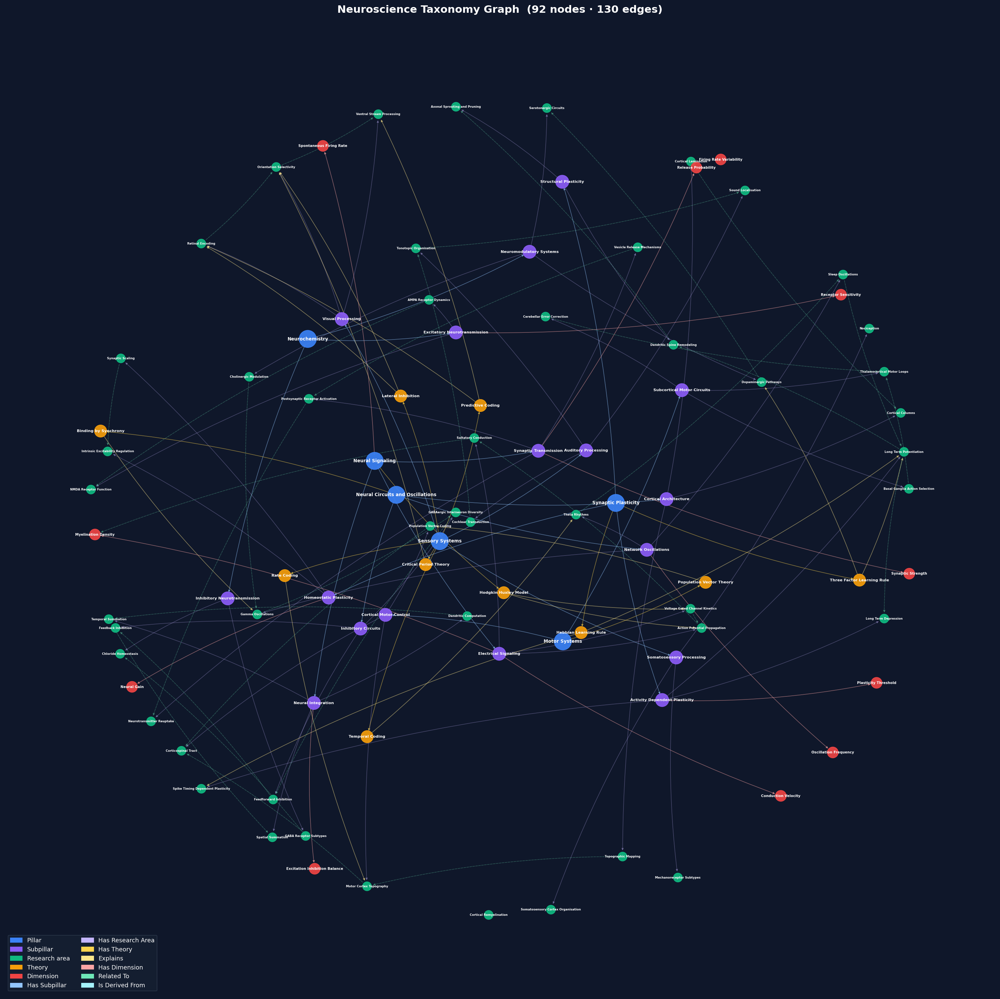

# Neurohive — Neuroscience Knowledge Query Pipeline

**Author:** Ivan Debono

A retrieval-augmented generation (RAG) pipeline that takes a natural language question and returns a structured, evidence-grounded answer drawn exclusively from the curated neuroscience knowledge store. Every factual claim is traceable to a specific taxonomy concept or peer-reviewed paper excerpt — sources that do not appear in the retrieved context are stripped before the response is returned.

---

## My Approach

The task is to build a system that gives *useful and grounded* answers about neuroscience using a fixed knowledge store: a taxonomy graph of 92 concepts connected by 130 typed edges, and 83 paper chunks from 24 peer-reviewed publications. The core challenge is retrieving the right context and ensuring the language model cannot go beyond it.

### 1. Retrieval

I use **BM25 Okapi** as the primary retrieval method. BM25 is well-suited here because the knowledge base is domain-specific: terminology like "voltage-gated channel kinetics" or "spike-timing-dependent plasticity" appears verbatim in both queries and documents. The BM25 implementation is pure Python (standard library only), so the pipeline runs with no retrieval dependency by default.

I run two independent retrieval passes — one over taxonomy nodes, one over paper chunks — so the system can find relevant concepts and relevant papers independently.

The retriever also uses structure from the paper data. Paper chunks are indexed with their linked taxonomy node IDs plus the linked node names, types, and descriptions, so a query that matches taxonomy language can retrieve the right paper chunk even when the phrase is absent from the chunk text. Retrieved chunks then contribute their `taxonomy_node_ids` to graph expansion, meaning paper evidence can pull in the right taxonomy neighbourhood. Chunks from the same DOI receive a context boost, but that boost decays with `chunk_index` distance so adjacent passages are preferred over distant passages from the same paper.

For users who install the optional `sentence-transformers` extra and download the embedding model, retrieval upgrades automatically to **BM25 + dense cosine similarity**, fused via Reciprocal Rank Fusion (RRF). This handles semantic paraphrasing that BM25 misses. The switch is invisible, and the pipeline detects the model directory at startup.

BM25 indices and optional dense embeddings are cached under the configured database/cache directory during `--ingest`. Subsequent runs load valid caches when the indexed corpus hash, retrieval parameters, and model path still match.

### 2. Graph Expansion

Pure retrieval on a small knowledge base risks missing essential context. If a query retrieves "Long-Term Potentiation", the answer is much better if the model also has the parent node ("Synaptic Plasticity"), the governing theory ("Hebbian Learning Rule"), and closely related areas ("NMDA Receptors").

`smart_expand()` traverses the taxonomy graph one hop from the seed set, adding parents, theories, dimensions, and lateral neighbours. Six of the seven edge types are directed; `RELATED_TO` is the only bidirectional edge and is therefore traversed in **both** incoming and outgoing directions. I use the **confidence score** on each edge to gate this expansion: weak connections are excluded. Algorithmically inferred edges (`map_source="semantic"`) are held to a stricter threshold (`confidence_threshold + 0.1`) to offset their higher noise compared to manually curated canonical edges. Edges that pass the threshold but are not at full confidence are annotated in the context so the model can hedge appropriately.

### 3. Prompt Design and Grounding

The prompt is structured in three layers:

1. **System prompt** — instructs the model to use only the supplied context and to explicitly state when the context is insufficient rather than speculating.
2. **User prompt** — the query plus two clearly delimited sections: `TAXONOMY CONTEXT` (the expanded graph neighbourhood, formatted as a hierarchy with breadcrumbs, human-readable edge labels such as "explains" and "is related to", and `[inferred]` tags on algorithmically-derived edges) and `PAPER EVIDENCE` (chunks grouped by paper, in reading order, with linked concept names).
3. **Structured output** — generation runs either through the Anthropic API or a local Ollama model. The Anthropic backend uses `tool_choice` to force the model into the JSON schema (`answer`, an array of paper/taxonomy triples). The Ollama backend requests JSON mode and validates the returned schema before the result enters verification. Citations and taxonomy documents are derived later by verification.

### 4. Citation Verification

The prompt constraint reduces hallucinations but cannot eliminate them. After generation, `_verify()` programmatically checks every citation and taxonomy reference in the model's output against the *actually retrieved* context. Anything that cannot be traced is stripped and a warning is emitted. The final answer is guaranteed to contain only sources the retrieval step found.

### Design Choices

- **No external retrieval library**: BM25 is implemented directly with standard-library Python. It precomputes document lengths, IDF values, and inverted postings, then persists those indices during ingestion.
- **Optional hybrid upgrade**: users who want stronger retrieval can `make setup-embeddings`. The default works without it.
- **Generation backend choice**: use Anthropic for stronger API-hosted generation, or pass `--ollama` to use a local open-source model through Ollama. The default Ollama model is `ministral-3:3b`.
- **Configuration in one place**: `config.toml` is the source for model names, runtime paths, retrieval tuning, and cache artifact names. Query-level settings can also be overridden per query via CLI flags.
- **SQLite-backed knowledge store**: raw source files live in the configured data directory; the pipeline auto-builds the SQLite database on first run using the stdlib `sqlite3` module. No additional database dependency required.


---

## The Final Prompt

Every query is sent to the language model using this structure.

**System prompt** (sent to Anthropic or Ollama; Anthropic also uses prompt caching):

```
You are a closed-context neuroscience query system. The TAXONOMY CONTEXT and
PAPER EVIDENCE sections in the user message are your complete and only source
of knowledge. You have no other knowledge available.

Absolute rules — every rule is a hard constraint, not a guideline:
1. Use ONLY facts that appear verbatim or by direct implication in the provided
   TAXONOMY CONTEXT or PAPER EVIDENCE. Nothing else.
2. Do NOT draw on your training data, even for background context, definitions,
   or facts you are certain are correct. If it is not in the provided context,
   it does not exist for this query.
3. If the context is insufficient to answer the query fully, produce at least one
   taxonomy triple using the most relevant concept available; set the claim to
   state explicitly what is covered and what information is absent. Do not fill
   gaps with training knowledge under any circumstances.
4. Express every factual claim as a structured triple of one of two types:
   • Paper triple  (drawn from PAPER EVIDENCE):
       type: "paper", claim: one sentence, quote: verbatim passage, citation: "Surname et al., Year"
   • Taxonomy triple  (drawn from TAXONOMY CONTEXT):
       type: "taxonomy", claim: one sentence, concept: exact concept name
   Every factual sentence must map to exactly one triple.
5. Do not speculate, infer beyond what the context states, or add qualifications
   drawn from general neuroscience knowledge.
```

**User prompt** (filled in per query):

```
Query: {query}

---
TAXONOMY CONTEXT
[Research_area] Neural Signaling → Electrical Signaling → Action Potential Propagation
  The active spread of an action potential along the axon ...
  explains → Hodgkin Huxley Model [confidence: 93%]
    (Hodgkin-Huxley equations predict the shape and velocity of propagating action potentials)
  is related to → Saltatory Conduction [confidence: 88%]

[Theory] Hodgkin Huxley Model
  A conductance-based mathematical model describing action potential generation ...
...

---
PAPER EVIDENCE
[Catterall et al., 2017] "Voltage-Gated Sodium Channels" DOI:10.1085/...
  Concepts: Action Potential Propagation, Voltage Gated Channel Kinetics
  • Voltage-gated sodium channels initiate action potentials by opening ...
...

---
Answer the query using ONLY the context above. Express every factual claim
as a paper or taxonomy triple. Do not use any knowledge outside these two sections.
Return only a JSON object with one top-level key, "answer".
```

**How the context sections are built:**

`TAXONOMY CONTEXT` is assembled in three passes for each query:

1. **Retrieval** — BM25 (or BM25 + dense via RRF) scores every node by how closely its name, type, description, and attached edge notes match the query. Paper chunks are scored separately using title, text, `chunk_index`, explicit `taxonomy_node_ids`, and the names/types/descriptions of linked taxonomy nodes.
2. **Seed construction** — the graph seed set combines the top-k retrieved taxonomy nodes with every taxonomy node ID attached to the top-k retrieved paper chunks.
3. **Graph expansion** — `smart_expand()` traverses one hop from the seed set, adding: parent Pillars and Subpillars (via `HAS_SUBPILLAR` / `HAS_RESEARCH_AREA`), Theory nodes that explain the seed concept (incoming `EXPLAINS`), Dimension nodes that characterise it (outgoing `HAS_DIMENSION`), and lateral neighbours in both directions (bidirectional `RELATED_TO`). Edges are followed only if `confidence ≥ threshold`; algorithmically-inferred edges (`map_source="semantic"`) are held to a stricter bar (`threshold + 0.1`).
4. **Formatting** — the expanded set is sorted by type depth (Pillar → Subpillar → Research_area → Theory → Dimension) and each node is rendered with its full breadcrumb ancestry path, its description, and every outgoing edge to another in-context node. Edge types are mapped to natural-language phrases (`EXPLAINS →` becomes `explains →`; `HAS_DIMENSION →` becomes `is characterised by →`). Edges with `confidence < 1.0` show their score. Algorithmically-derived edges (`map_source="semantic"`) are tagged `[inferred]`; other non-canonical sources show their source name. Nodes with no edges in either direction are tagged `[no connections]` so the model knows the absence of relationships is a property of the concept, not a retrieval gap.

`PAPER EVIDENCE` is built from two sources, then deduplicated:

1. **Direct retrieval** — the top-k chunks from the BM25/RRF pass over the paper corpus.
2. **Node-linked harvest** — every chunk whose `taxonomy_node_ids` list overlaps the expanded node set is added. This surfaces papers relevant to the expanded context even if they did not rank highly in direct retrieval.

Within each paper, chunks are sorted by `chunk_index` to preserve reading order. Chunks from the same DOI are grouped under a single citation header. During retrieval, chunks from the same DOI are context-boosted with a score floor that decays by `chunk_index` distance from the initially retrieved seed chunk, so nearby paper context is favoured.

**Raw model output schema** (enforced by Anthropic `tool_choice`; requested and validated for Ollama):

```json
{
  "answer": [
    {"type": "paper",    "claim": "one-sentence statement", "quote": "verbatim passage", "citation": "Surname et al., Year"},
    {"type": "taxonomy", "claim": "one-sentence statement", "concept": "exact concept name"}
  ]
}
```

Each element is either a **paper triple** (grounded in PAPER EVIDENCE) or a **taxonomy triple** (grounded in TAXONOMY CONTEXT). `_verify()` checks every triple against the retrieved context before the answer is assembled.

---

## Knowledge Store

The pipeline is built over two data sources in `data/raw/`:

**Taxonomy graph** — 92 neuroscience concept nodes across five types (Pillar, Subpillar, Research_area, Theory, Dimension), connected by 130 typed edges. Each edge carries a `confidence` score (0–1) and a `map_source` field (`canonical` or `semantic`).



*Node colours: blue = Pillar, purple = Subpillar, green = Research\_area, amber = Theory, red = Dimension. Dashed edges = RELATED\_TO (bidirectional); solid = directed.*

**Paper corpus** — 83 text chunks from 24 peer-reviewed publications (2001–2022), each pre-linked to one or more taxonomy nodes via `taxonomy_node_ids`.

---

## Installation

**Requirements:** Python 3.13+, [`uv`](https://docs.astral.sh/uv/)

### Choose a generation backend

**Anthropic API** is the default runtime backend:

```bash
git clone <repo-url>
cd neurohive
make setup
uv run python main.py --ingest   # build database + retrieval caches from data/raw/
```

It requires an API key:

```bash
# Option A: environment variable
export ANTHROPIC_API_KEY="sk-ant-..."

# Option B: .env file at the repo root (loaded automatically)
echo 'ANTHROPIC_API_KEY=sk-ant-...' > .env
```

**Local Ollama** avoids paid API calls and uses the configured open-source model (`llama3.2:3b` by default):

```bash
git clone <repo-url>
cd neurohive
make setup-ollama              # installs Python deps and runs: ollama pull llama3.2:3b
uv run python main.py --ingest # build database + retrieval caches
```

You must install and start Ollama first. After setup, use `--ollama` at runtime.

### Optional: hybrid retrieval (BM25 + dense)

```bash
make setup-embeddings   # installs sentence-transformers and downloads the model (~90 MB)
```

Hybrid mode activates automatically on the next run when the configured model exists under `[paths] models_dir`. Run `uv run python main.py --ingest` after downloading the model to precompute and cache embeddings.

### Optional: NLI entailment verification

```bash
make setup-nli   # installs sentence-transformers and downloads the cross-encoder (~568 MB)
```

Pass `--verify` at the CLI to enable post-generation entailment checking.

### Optional: both at once

```bash
make setup-embeddings-nli   # installs and downloads both models in one step
```

### Optional: local Ollama + hybrid retrieval + NLI

```bash
make setup-ollama-embeddings-nli
```

This installs the embedding/NLI Python extras, pulls the configured Ollama generation model, downloads the configured embedding model, and downloads the configured NLI cross-encoder. Use `--ollama` for local generation and `--verify` for NLI verification.

---

## How to Run

### First-run database and retrieval cache setup

On the very first run the knowledge-base database is built automatically from the raw files in the configured data directory. You can also trigger this explicitly to rebuild the database and refresh retrieval caches after adding raw data, changing chunk taxonomy links, changing retrieval parameters, or downloading an embedding model:

```bash
uv run python main.py --ingest
```

### Single query

```bash
uv run python main.py "What is the role of voltage-gated sodium channels in action potential initiation?"
```

### Interactive Read-Evaluate-Print Loop

```bash
uv run python main.py
# Type your question and press Enter. 'quit' or Ctrl-C to exit.
```

### Show retrieved sources alongside the answer

```bash
uv run python main.py --show-sources "How does long-term potentiation relate to NMDA receptors?"
```

### Use a different model

```bash
uv run python main.py --model claude-sonnet-4-6 "Explain inhibitory interneuron diversity."
```

### Use local Ollama instead of Anthropic

Use the configured default Ollama model:

```bash
uv run python main.py --ollama "Explain inhibitory interneuron diversity."
```

Use a specific local Ollama model:

```bash
uv run python main.py --ollama llama3.1:8b "Explain inhibitory interneuron diversity."
```

### Tune query-time parameters

The most common query-time settings can be overridden at the command line for a single query without editing the file:

```bash
uv run python main.py --node-top-k 10 --chunk-top-k 8 --confidence-threshold 0.75 "query..."
uv run python main.py --model claude-sonnet-4-6 --entailment-threshold 0.6 --verify "query..."
```

To change permanent defaults, retrieval tuning, cache filenames, or runtime paths, edit `config.toml`.

### All CLI flags

| Flag | Default | Description |
|---|---|---|
| `--model MODEL` | config.toml `[anthropic] model` | Anthropic model ID (also reads `ANTHROPIC_MODEL` env var) |
| `--ollama [MODEL]` | config.toml `[ollama] model` | Use local Ollama instead of Anthropic; optionally pass an Ollama model name |
| `--node-top-k N` | config.toml `[pipeline] node_top_k` | Taxonomy nodes retrieved per query |
| `--chunk-top-k N` | config.toml `[pipeline] chunk_top_k` | Paper chunks retrieved per query |
| `--confidence-threshold F` | config.toml `[pipeline] confidence_threshold` | Minimum edge confidence for graph expansion (0.0–1.0) |
| `--embeddings-model MODEL` | config.toml `[embeddings] model` | HuggingFace model ID for dense retrieval |
| `--nli-model MODEL` | config.toml `[nli] model` | HuggingFace model ID for NLI entailment checking (used with `--verify`) |
| `--entailment-threshold F` | config.toml `[nli] entailment_threshold` | Minimum entailment probability for NLI verification (used with `--verify`) |
| `--show-sources` | off | Print retrieved nodes and chunks after the answer |
| `--verify` | off | Enable NLI entailment verification (requires `make setup-nli`) |
| `--debug` | off | Print raw model triples before verification |
| `--log` | off | Append a JSONL record for each query to `[paths] logs_dir/YYYY-MM-DD.jsonl` |
| `--ingest` | — | Build (or rebuild) the database and retrieval caches, then exit |

### Python API

```python
from neurohive.pipeline import QueryPipeline

pipeline = QueryPipeline()
result = pipeline.run("What are the mechanisms of synaptic scaling?")

print(result.answer)           # assembled prose from verified triples
print(result.citation)         # ["Turrigiano et al., 2013"]
print(result.document)         # ["Synaptic_Scaling", "Homeostatic_Plasticity"]
print(result.answer_triples)   # raw verified triples: [{"type": "paper", "claim": ..., "citation": ...}, ...]
print(result.retrieval_mode)   # "hybrid (BM25 + dense, RRF)" or "bm25"

import json
print(json.dumps(result.as_dict(), indent=2))
```

Use Ollama from Python:

```python
from neurohive.backends import OllamaBackend
from neurohive.pipeline import QueryPipeline

pipeline = QueryPipeline(backend=OllamaBackend())  # config.toml [ollama] model
result = pipeline.run("What are the mechanisms of synaptic scaling?")
```

---

## Configuration

All tunable parameters live in `config.toml` at the repo root:

```toml
[paths]
data_dir   = "data"
env_file   = ".env"
logs_dir   = "logs"
models_dir = "models"

[pipeline]
node_top_k           = 6
chunk_top_k          = 6
confidence_threshold = 0.8

[retrieval]
bm25_k1 = 1.5
bm25_b  = 0.75

node_rrf_k  = 30
chunk_rrf_k = 60

sibling_discount = 0.5

bm25_cache_version = 1
bm25_meta_file     = "bm25_meta.json"
node_bm25_file     = "node_bm25.json"
chunk_bm25_file    = "chunk_bm25.json"
emb_meta_file      = "emb_meta.json"
node_emb_file      = "node_embs.npy"
chunk_emb_file     = "chunk_embs.npy"

[anthropic]
model = "claude-haiku-4-5-20251001"

[ollama]
model = "llama3.2:3b"
host  = "http://localhost:11434"

[embeddings]
model = "sentence-transformers/all-MiniLM-L6-v2"

[nli]
model                = "cross-encoder/nli-deberta-v3-small"
entailment_threshold = 0.5
```

CLI flags exist for common query-time settings (see the flags table above). Resolution order: `CLI flag > ANTHROPIC_MODEL env var > config.toml > loader fallback`.

Retrieval and cache settings are config-only. Run `uv run python main.py --ingest` after changing `[retrieval]`, `[embeddings]`, `[nli]`, or paper chunk taxonomy links so generated caches match the new settings.

---

## Project Structure

```
neurohive/
├── assets/
│   └── taxonomy_graph.png         Taxonomy graph visualisation
│
├── data/
│   ├── raw/
│   │   ├── taxonomy_nodes.csv     92 neuroscience concept nodes
│   │   ├── taxonomy_edges.csv     130 typed relationships between nodes
│   │   ├── paper_chunks.json      83 excerpts from 24 peer-reviewed papers
│   │   └── README.md              Data schema reference
│   └── database/
│       ├── neurohive.db           SQLite database (auto-generated from raw/, gitignored)
│       ├── bm25_meta.json         BM25 cache metadata (generated by --ingest)
│       ├── node_bm25.json         Taxonomy BM25 index cache
│       ├── chunk_bm25.json        Paper chunk BM25 index cache
│       ├── emb_meta.json          Embedding cache metadata, when hybrid retrieval is enabled
│       ├── node_embs.npy          Taxonomy dense embeddings
│       └── chunk_embs.npy         Paper chunk dense embeddings
│
├── neurohive/
│   ├── entities/
│   │   ├── node.py                Node dataclass
│   │   ├── edge.py                Edge dataclass
│   │   └── paper_chunk.py         PaperChunk dataclass
│   ├── knowledge_base.py          SQLite-backed store; graph expansion and lookups
│   ├── retrieval.py               BM25 Okapi + optional hybrid RRF retriever
│   ├── backends.py                AnthropicBackend and OllamaBackend
│   ├── pipeline.py                QueryPipeline: end-to-end orchestration + _verify()
│   └── config.py                  Config loader (reads config.toml)
│
├── scripts/
│   ├── setup_ollama_model.py      Pulls the configured local Ollama model
│   ├── download_model.py          Downloads the configured embedding model
│   └── download_nli_model.py      Downloads the configured NLI cross-encoder model
│
├── tests/
│   ├── conftest.py                Shared fixtures and MockBackend
│   ├── test_backends.py
│   ├── test_models.py
│   ├── test_config.py
│   ├── test_knowledge_base.py
│   ├── test_retrieval.py
│   └── test_pipeline.py
│
├── logs/                          Per-day JSONL query logs (gitignored; created by --log)
│
├── main.py                        CLI entry point
├── config.toml                    All tunable parameters (single source of truth)
├── pyproject.toml
└── Makefile                       Run `make help` to see all targets
```

---

## Tests

Run the full test suite:

```bash
uv run pytest
```

Run a focused subset:

```bash
uv run pytest tests/test_retrieval.py tests/test_pipeline.py
```
